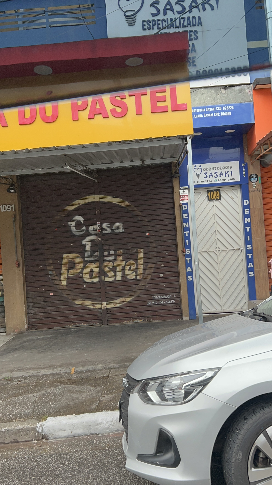

<!-- CABEÇALHO DOURADO -->

# Entrega 1 — Modelo Conceitual (DER)
### Modelagem de um Sistema de Gestão para a Odontologia Sasaki

 

> 🎓 **Integrantes do Grupo**
> - **Letícia Valentim Reges** — RGM: `047369680`
> - **Juan Arthur Franco** — RGM: `47232099`
> - **Isadora Do Nascimento Takami** - RGM: `47108932`
---

## 🏛️ 1. Caracterização da Organização

| Campo | Detalhes |
| :--- | :--- |
| **Nome e Natureza** | **Odontologia Sasaki**, uma clínica odontológica privada de médio porte, com fins lucrativos. |
| **Contexto e Porte** | ~20 funcionários (dentistas, auxiliares, técnicos, recepcionistas, manutenção). ~500 atendimentos/mês. Possui setor de produção própria (implantes, aparelhos ortodônticos, impressão 3D) e parque tecnológico distribuído. |
| **Problemas Identificados** | Informações descentralizadas em planilhas e anotações. Dificuldade no acompanhamento da localização, situação operacional, histórico de manutenção e estoque de peças/insumos. |
| **Justificativa** | O alto volume de equipamentos e processos internos tornando a clínica o cenário ideal para estruturação de um banco de dados relacional. |

### 📍 Evidências da Organização
* **Endereço:** R. Jardim Tamoio, 1089 - Conj. Res. José Bonifácio, São Paulo - SP, 08255-010
* **Google Maps:** [Acessar localização no Google Maps](https://maps.app.goo.gl/ALuZBqSGNaq6kBxy9)
* **Contato:** `Luduque@hotmail.com` | `+55 11 99001-2968`

  

  

---

## 🔄 2. Processos de Negócio

1. **Cadastro e Controle de Equipamentos:** Registro individual, localização, responsável e situação atual.
2. **Controle de Manutenção:** Registro de manutenções preventivas e corretivas, histórico de falhas e serviços executados.
3. **Controle de Estoque:** Gestão de entradas e saídas de peças, materiais e componentes do setor técnico/fabril.
4. **Produção Interna:** Registro da fabricação de implantes, aparelhos ortodônticos e impressões 3D.
5. **Controle de Consultórios:** Acompanhamento e inventário dos equipamentos instalados em cada ambiente.

---

## 🎯 3. Requisitos do Sistema

### ⚙️ 3.1 Requisitos Funcionais
- [x] Cadastrar, alterar e consultar equipamentos.
- [x] Registrar a localização física e o funcionário responsável.
- [x] Registrar manutenções preventivas e corretivas.
- [x] Permitir consulta ao histórico operacional completo.
- [x] Controlar movimentações (entrada/saída) de estoque.
- [x] Registrar equipamentos e peças produzidos internamente.
- [x] Informar status em tempo real *(Disponível, Em Manutenção, Inativo, Em uso)*.
- [x] Mapear o inventário individual por consultório.

### 🛡️ 3.2 Requisitos Não Funcionais
* **Segurança:** Autenticação obrigatória para acesso às funcionalidades.
* **Usabilidade:** Interface intuitiva e de fácil operação no dia a dia.
* **Desempenho:** Respostas e consultas otimizadas.
* **Disponibilidade:** Acesso contínuo para suporte às rotinas operacionais.
* **Integridade:** Consistência nos dados, evitando inconsistências e duplicidades.

---
## 📜 4. Regras de Negócio

### 📋 Regras Operacionais
* **RN01:** Todo equipamento deve obrigatoriamente ter cadastro no sistema.
* **RN02:** Todo equipamento deve estar associado a um consultório ou localização física.
* **RN03:** Toda manutenção executada deve ser vinculada ao histórico do equipamento.
* **RN04:** Equipamentos com status `"Em Manutenção"` ficam bloqueados para uso.
* **RN05:** Toda saída de peças/materiais do estoque exige registro imediato.
* **RN06:** Qualquer lote de produção deve gerar uma ordem correspondente no sistema.

### 💡 Restrições Organizacionais
> A atualização rigorosa do sistema previne o uso de equipamentos defeituosos, reduzindo paralisações nos atendimentos. O histórico centralizado permite acompanhar a vida útil dos aparelhos, planejar substituições preventivas e controlar custos operacionais.

---

## 📚 5. Dicionário de Dados Conceitual (Preliminar)

### 🩺 Mapeamento do Parque Tecnológico (Equipamentos)

| Aparelho / Equipamento | Descrição | Regra de Negócio Associada |
| :--- | :--- | :--- |
| **Cadeira Odontológica** | Acomodação do paciente durante o atendimento. | Vinculada a um consultório. Manutenções registradas. |
| **Scanner Intraoral** | Captura digital da arcada dentária para modelos 3D. | Restrito a profissionais autorizados. |
| **Scanner de Bancada** | Digitalização de modelos físicos para projetos CAD. | Registro e manutenção controlados no sistema. |
| **Impressora 3D Odontológica** | Fabricação de modelos, guias e placas digitais. | Controle rigoroso de manutenção e insumos. |
| **Fresadora CAD/CAM** | Usinagem de peças a partir de projetos digitais. | Operação permitida apenas no status "Disponível". |
| **Forno de Sinterização** | Processamento térmico de materiais sintéticos. | Controle de ciclos e temperatura de operação. |
| **Forno para Cerâmica** | Acabamento de próteses cerâmicas. | Restrito a profissionais autorizados. |
| **Polimerizadora** | Polimerização de resinas e materiais odontológicos. | Requer manutenção preventiva regular. |
| **Jateadora / Polidora** | Tratamento de superfície, acabamento e polimento. | Manutenção e higienização periódicas. |
| **Autoclave** | Esterilização de instrumentos operacionais. | Controle de ciclos e revisões periódicas. |
| **Aparelho de Raio-X** | Obtenção de imagens radiográficas. | Inspeção técnica e manutenção preventiva obrigatórias. |
| **Compressor de Ar** | Fornecimento de ar comprimido aos consultórios. | Manutenção preventiva para evitar parada geral. |
| **Computador CAD** | Planejamento digital de próteses e implantes. | Acesso restrito e backup dos projetos digitais. |

 

### Estrutura da Entidade `EQUIPAMENTO` 🗂
| Atributo | Descrição | Restrição / Regra |
| :--- | :--- | :--- |
| `id_equipamento` | Identificador único do equipamento | Chave Primária 🔑
(PK), Obrigatório |
| `nome_equipamento` | Nome comercial do aparelho | Obrigatório |
| `tipo_equipamento` | Categoria/tipo do equipamento | Obrigatório |
| `numero_serie` | Número de série do fabricante | Único |
| `data_aquisicao` | Data de compra do ativo | Obrigatório |
| `status` | Situação operacional do ativo | *Disponível, Manutenção, Inativo,
Em uso* |
| `localizacao` | Consultório ou sala onde está instalado | Informado
obrigatoriamente |
| `responsavel` | Funcionário responsável pelo ativo | Cadastrado previamente |
| `ultima_manutencao` | Data da última intervenção técnica | Atualizado
automaticamente |
| `proxima_manutencao` | Data prevista para próxima revisão | Controle
Preventivo |
---

## 6. Modelagem Conceitual 📐
### Entidades Mapeadas 📦
* **`EQUIPAMENTO`**: Representa os ativos e aparelhos da clínica.
* **`MANUTENÇÃO`**: Registra as intervenções técnicas e histórico de reparos.
* **`ESTOQUE`**: Controla insumos, peças e componentes do setor técnico.
* **`PRODUÇÃO`**: Registra os itens/próteses fabricados internamente.
* **`CONSULTÓRIO`**: Ambientes físicos onde ficam alocados os equipamentos.
* **`FUNCIONÁRIO`**: Colaboradores envolvidos no uso, manutenção e gestão.

### Relacionamentos e Cardinalidades 🔗
* **Consultório — Equipamento `(1:N)`:** Um consultório pode possuir vários
equipamentos; cada equipamento está instalado em um único consultório.
* **Equipamento — Manutenção `(1:N)`:** Um equipamento pode passar por várias
manutenções; cada manutenção pertence a um equipamento.
* **Funcionário — Manutenção `(1:N)`:** Um funcionário pode executar/registrar
várias manutenções; cada registro tem um responsável.
* **Funcionário — Equipamento `(1:N)`:** Um funcionário pode responder por
múltiplos equipamentos.
* **Estoque — Produção `(N:N)`:** Uma ordem de produção consome múltiplos itens
do estoque; cada item do estoque atende a várias produções. *(Nota: Na modelagem
lógica, este relacionamento será convertido na entidade associativa
`ITEM_PRODUÇÃO`)*.
---
## 8. Justificativa Técnica 🛠
> A modelagem conceitual foi estruturada especificamente para responder às
demandas operacionais da **Odontologia Sasaki**. A entidade **`EQUIPAMENTO`**
assume o papel central, organizando dados que antes ficavam dispersos.
>
> A criação da entidade **`MANUTENÇÃO`** de forma independente permite o
registro de um histórico ilimitado de intervenções sem poluir a tabela de
equipamentos. O desacoplamento de **`CONSULTÓRIO`** e **`FUNCIONÁRIO`** elimina
duplicidades de cadastro, enquanto as entidades **`ESTOQUE`** e **`PRODUÇÃO`**
garantem rastreabilidade aos insumos utilizados na fabricação de peças 3D e
próteses.
---
## 9. Uso de Inteligência Artificial 🤖
A Inteligência Artificial foi utilizada estritamente como **ferramenta de
apoio** para organização, estruturação de ideias, revisão e padronização do
código. Todas as decisões técnicas e validações do negócio foram efetuadas pelo
grupo.
### 9.1 ChatGPT
* **Etapa:** Organização das ideias, levantamento inicial dos processos de
negócio, requisitos e estrutura do dicionário de dados.
* **Prompts:** *"Crie uma clínica com o nome Odontologia Sasaki e desenvolva
informações sobre seu contexto, porte e problemas no controle de
equipamentos..."*
* **Avaliação Crítica:** As sugestões genéricas foram revisadas e adaptadas à
realidade operacional da Odontologia Sasaki.
### 9.2 Claude
* **Etapa:** Harmonização do código, otimização da estrutura em Markdown/HTML e
padronização para exibição no GitHub.
* **Prompts:** Pedidos para analisar, harmonizar e estilizar o documento em tons
elegantes de dourado e branco.
* **Avaliação Crítica:** As alterações estéticas foram aprovadas preservando
100% do conteúdo conceitual e lógico desenvolvido.
---

Odontologia Sasaki ©
2026 • *Documentação do Projeto de Banco de Dados*

